##ОТЧЁТ О ЛАБОРАТОРНОЙ РАБОТЕ №6 
## ПО ОСНОВАМ ПРОГРАММИРОВАНИЯ

###Ход работы:
Cделала копию на сайте GitHubhttps://github.com/Kurtyanik/LR6/

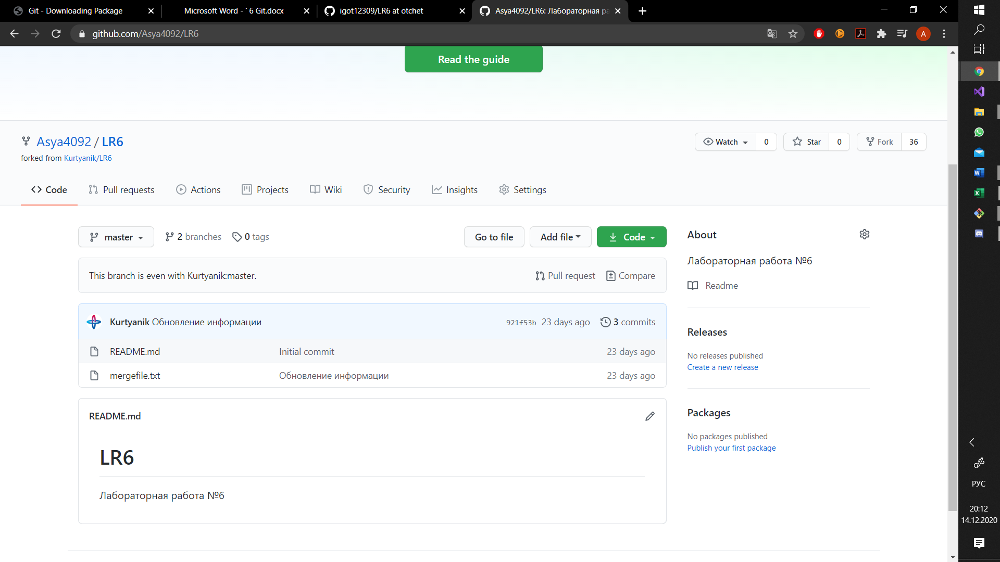

В консоли Git Bash перешла в созданную на рабочем столе папку oplr6

Далее использовала команду _git init_, чтобы инициализировать гит в данной папке

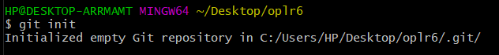

С помощью команды _git remote add origin_ связала папку с удалённым репозиторием на сайте GitHub

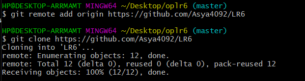

Затем через графический интерфейс GitHub добавила новый файл op.txt в удалённый репозиторий и добавила его в ветку __master__

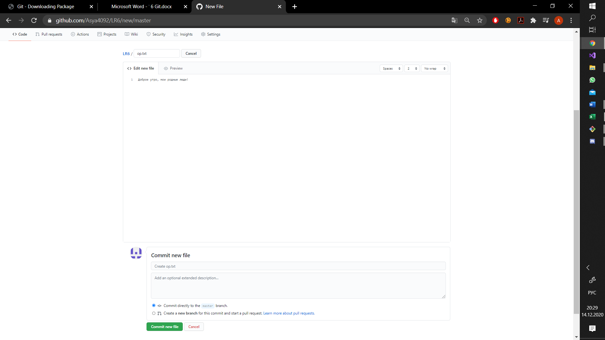

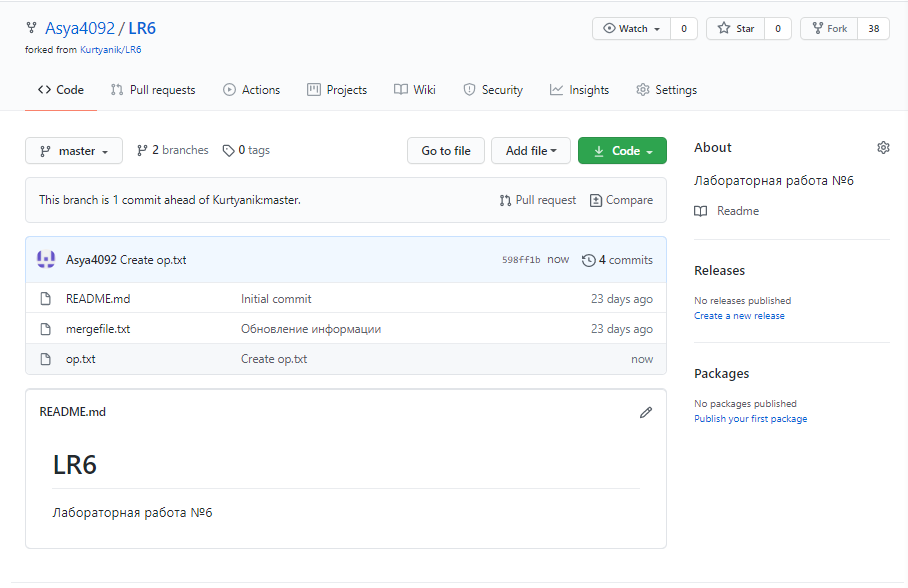

Пользуясь командой _git pull origin master_ , загрузила изменения из удалённого репозитория в локальный

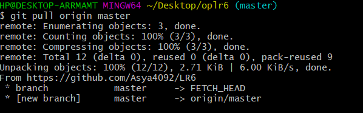

Командой _git log_ получила список операций/коммитов

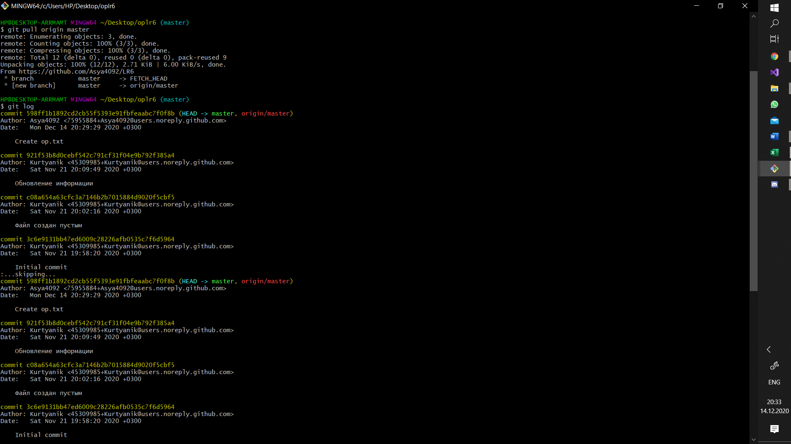

Используя _git show *commit SHA-1*_ , получила более подробную информацию по последнему изменению

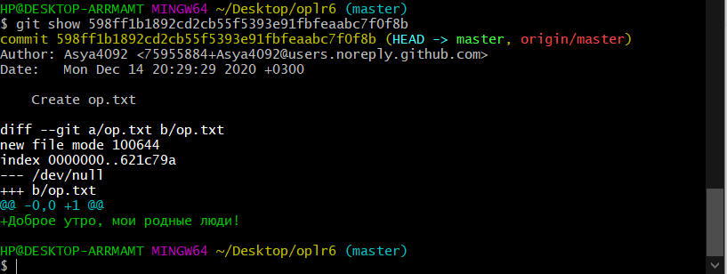

Командой _git checkout -t branch1_ попыталась переключится на другую ветку **branch1**, но выдало ошибку. Поэтому с помощью команды _git remote update_ обновила подключение к сайту GitHub и заново выполнила переключение на ветку **branch1**

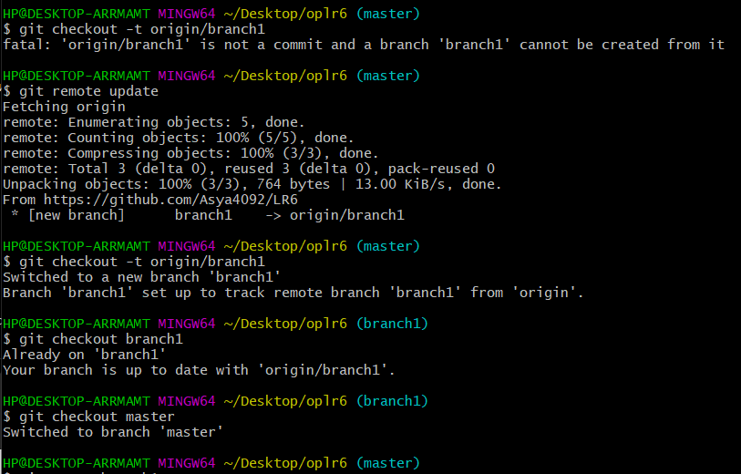

Попыталась выполнить слияние веток **master** и **branch1** командой _git merge branch1_ , попросило авторизоваться

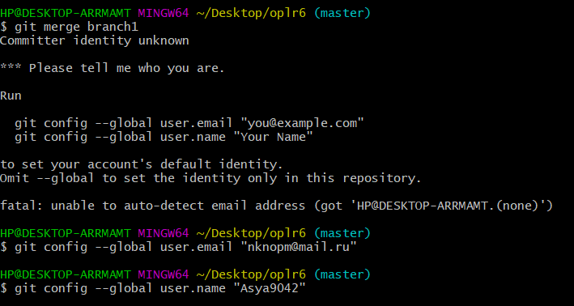

Заново попыталась выполнить слияние и получила ошибку 

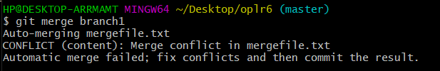

Вручную изменила файл mergefile.txt, вызвавший ошибку слияния и выполнила коммит

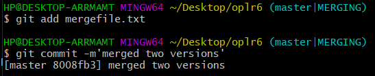

Выполнила слияние веток **master** и **branch1** а затем удалила ветку **branch1** командой _git branch -d branch1_

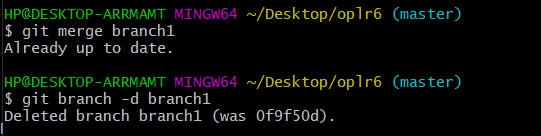

Запушила всё в удалённый репозиторий командой _git push origin master_ 

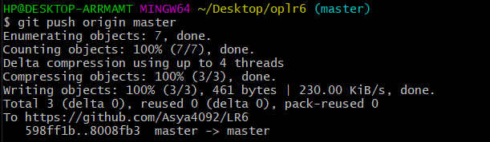

Затем сделала несколько изменений, добавив новые файлы text2.txt и text3.txt

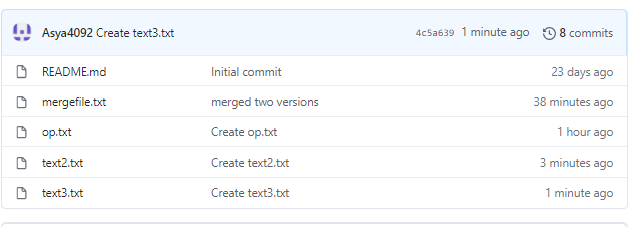

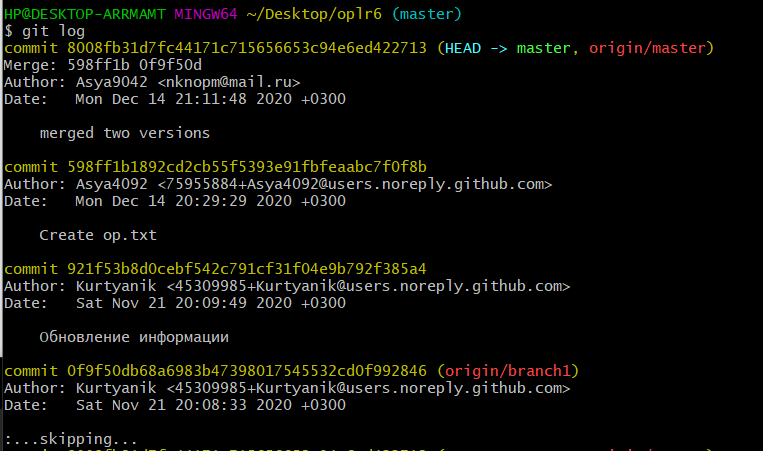

Командой _git reset --hard HEAD~1_ выполнила откат последнего коммита - добавления файла **text3.txt**

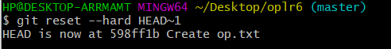

Запушила изменённую ветку _git push -f origin master_

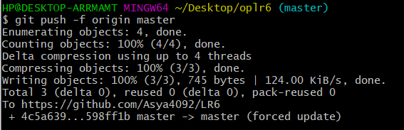

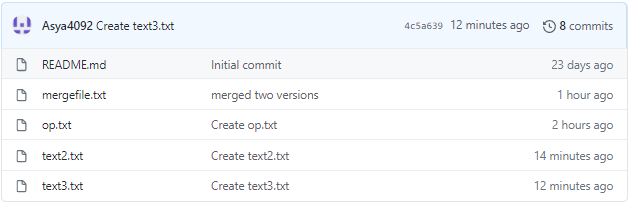

Пользуясь командой _git checkout -b otchet_ , создала новую ветку **otchet**

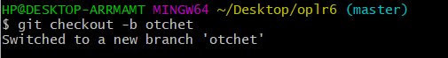

С помощью команды _git add ._ подготовила все новые файлы в папке **oplr6** к пушу

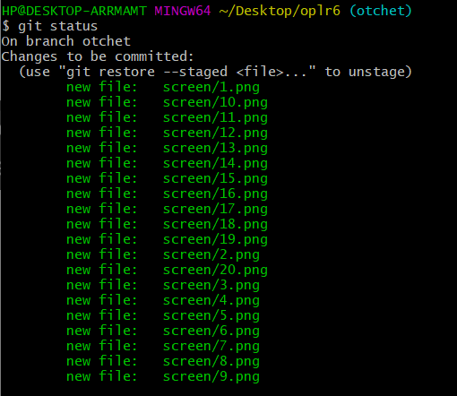

Запушила файлы скриншотов в удалённый репозиторий

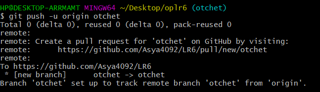

Оформляю отчёт в файле **README.md** , используя блокнот

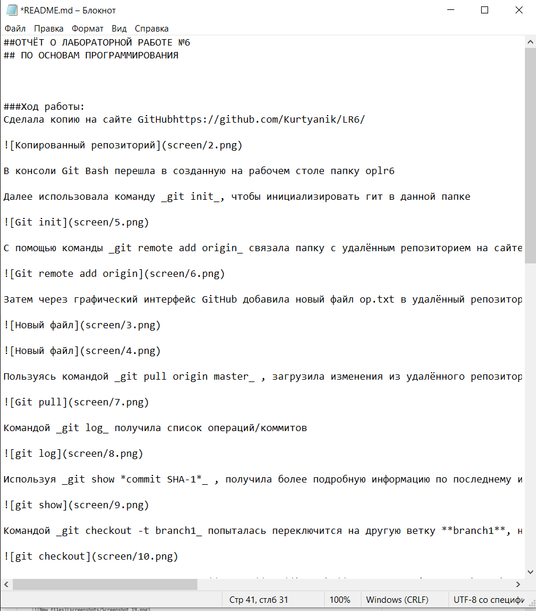

Лог команд из папки **.git/logs**

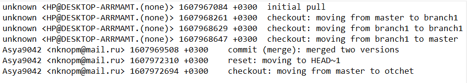

Финальный результат команды _git log_

Все файлы скриншотов лежат в папке **screen**
